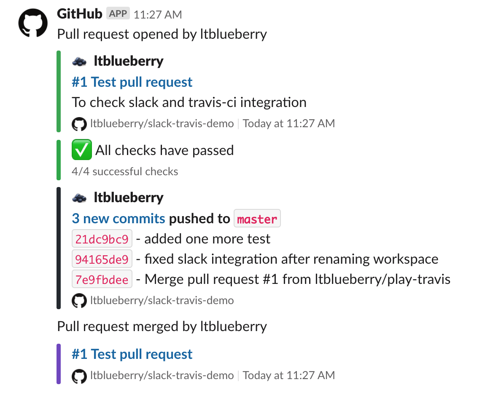
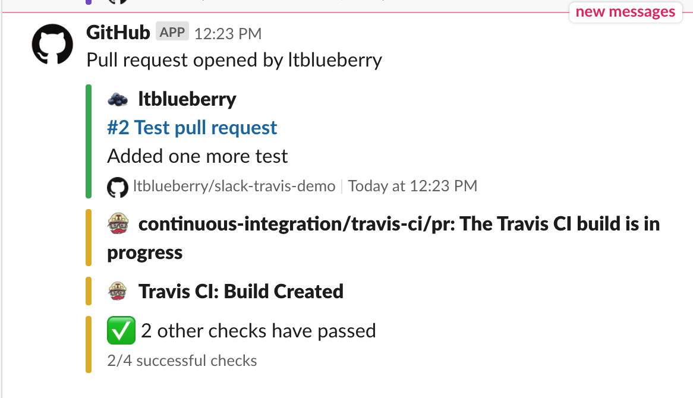
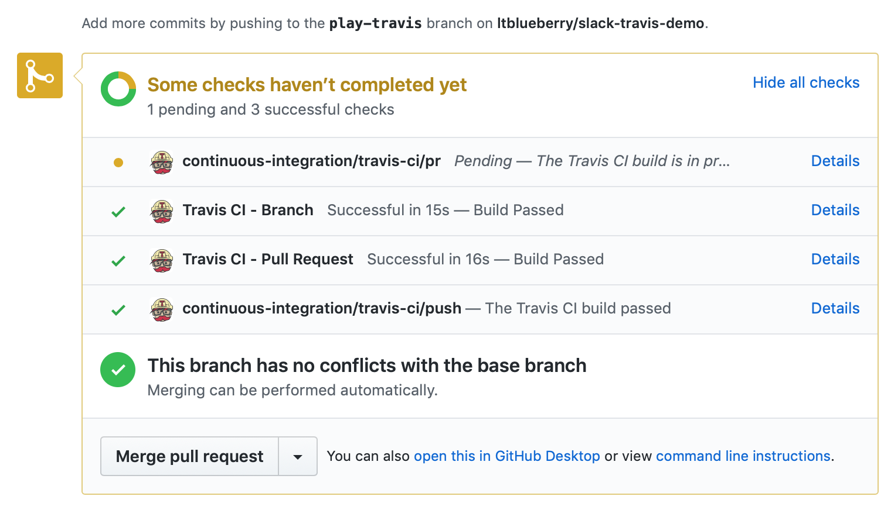
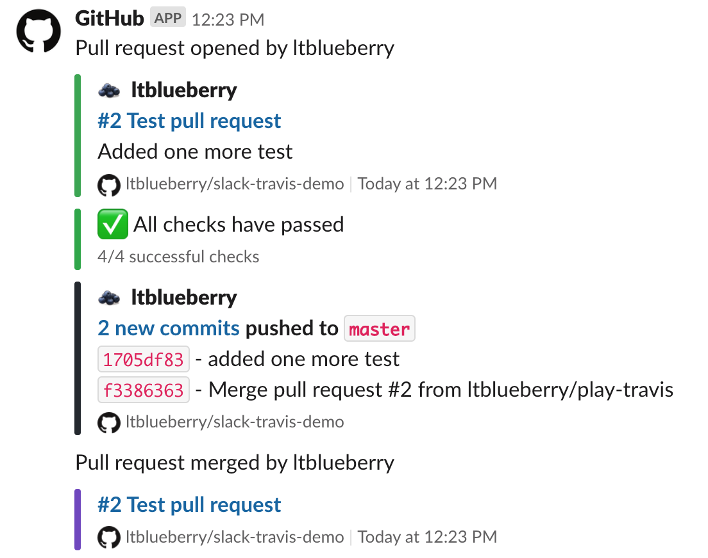
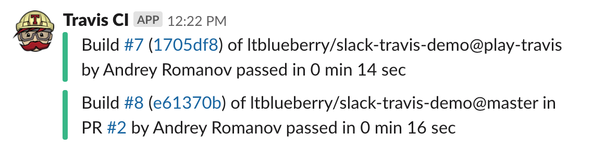

# Slack Travis-CI Demo Project

[](https://travis-ci.org/ltblueberry/slack-travis-demo)

# About
It's a simple demo project, to improve and refresh skills, and have some practice in integrating **Github** + **Slack** + **Travis-CI**.
Contains **simpliest tests** in Python.


### Integrate Travis-CI to Github
Just find it in Github Marketplace and follow the instructions.

### Slack workspace
You need Slack workspace and account to make Slack integrations with Github and Travis-CI.

### Slack integrations
In Slack just click "Add apps" button and find "Github" and "Travis-CI" apps for slack. Select channel where you want to receive notifications.

For subscription on Github repo just type subscribe command in channel
```
/github subscribe <owner>/<repository>

# Example. For this repo it will be
/github subscribe ltblueberry/slack-travis-demo
```

Add Travis-CI app to channel. You will get token, which is used in **.travis.yml** configuration file. 
You can see or regenerate this token in **Slack Workspace** -> **Administration** -> **Manage apps** -> **Travis CI** -> **Configuration**.

### Travis CLI 
We need travis cli **to encrypt** Slack Travis-CI App token to store in **.travis.yml** configuration file.

Install Travis CLI for MacOS
```
brew install travis
```

To login we need to have Github Access token. Open Github **Settings** -> **Developer settings** -> **Personal access tokens** and create token for travis integration. You need at least **public_repo** permission.

Login to Travis CLI
```
travis login --github-token=<token>
```

### Project
I made simple project with one file with tests **test.py** in **play-travis** folder.
Also I made bash script **test.sh** that executes in Travis-CI.
I added configuration file for Travis-CI is **.travis.yml**. It had next content
```
dist: trusty
sudo: required
language: bash
before_install:
- bash test.sh
```

It's a simple config for a simple project.

### Encrypting token
To add encrypted slack token to your **.travis.yml** configuration file you need to execute next command (**switch to repository directory before command execution**)
```
travis encrypt "<slack_workspace_name>:<slack_travis_token>" --add notifications.slack
```
You can find **your** command in Slack Travis app settings (**Encrypting your credentials section*).

After that you can find next strings in your **.travis.yml**
```
notifications:
  slack:
    secure: <your encrypted string>
```

# Result

PR #1 completed and there are next notifications in Slack channel.


PR #2 was created. You can see it is in progress.

Github PR#2 info.


PR #2 completed and there are next notifications in Slack channel.


Travis notifications about commit to **play-travis** branch and **PR #2**

